# Banking Fraud Detection and Risk Analytics

Machine learning project for classifying banking transactions as genuine or potentially fraudulent and assigning a transaction-level risk score.

## Project Summary

This repository contains the implementation of a banking transaction fraud detection workflow using Python and scikit-learn.

The workflow covers:

- Data inspection and cleaning
- Exploratory analysis
- Feature preparation
- Categorical encoding
- Train/test splitting
- Classification model training
- Model evaluation
- Fraud probability estimation
- Risk score calculation
- Risk category assignment

Two classification models are implemented:

- Logistic Regression
- Random Forest

The final prediction is converted into a fraud probability, a score between 0 and 100, and a corresponding risk category.

## Problem

A banking transaction can differ from a customer's usual activity in several ways, including transaction amount, transaction type, device, location, or transaction timing.

The purpose of this project is to use available transaction attributes to classify transactions and identify records that may require additional review.

The target variable is `fraud`:

```text
0 = Genuine transaction
1 = Fraudulent transaction
```

## Dataset

The dataset contains transaction-level banking information.

| Column | Description |
|--------|-------------|
| `transaction_id` | Unique identifier for the transaction |
| `customer_id` | Identifier associated with the customer |
| `amount` | Transaction amount |
| `transaction_type` | Type of transaction |
| `timestamp` | Transaction date and time |
| `device` | Device used for the transaction |
| `location` | Transaction location |
| `fraud` | Binary target variable |

## Workflow

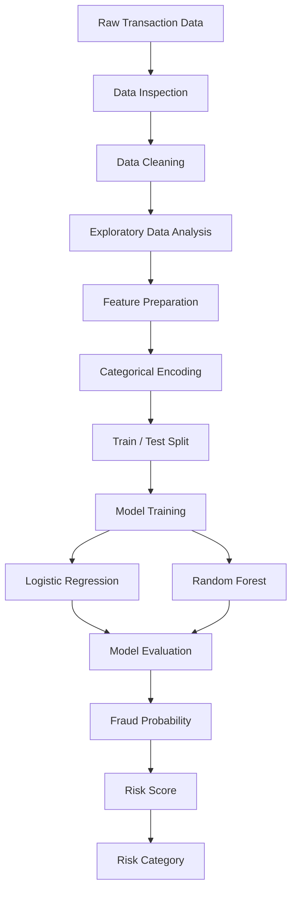

## Data Preparation

The dataset is first inspected to understand its structure, data types, dimensions, and data quality.

The preparation process includes:

- Loading the CSV file using Pandas
- Inspecting the available columns and records
- Checking missing values
- Checking duplicate records
- Reviewing transaction values
- Separating features from the target variable
- Encoding categorical variables

The categorical fields used by the model are converted into numerical features using one-hot encoding.

The resulting dataset is divided into training and testing data using an 80:20 split with stratification on the fraud target.

## Exploratory Analysis

Exploratory analysis is used to examine the distribution of transactions and identify patterns within the available data.

The implementation generates visualizations for:

- Fraud distribution
- Transaction amount distribution
- Transaction type
- Location
- Device
- Feature correlation
- Model confusion matrix
- ROC curve
- Risk distribution
- Risk score distribution

The generated charts are available in:

```text
outputs/plots/
```

## Models

### Logistic Regression

Logistic Regression is used as the baseline classification model.

It estimates the probability of a transaction belonging to the fraudulent class and provides a reference model for comparison.

### Random Forest

Random Forest is used as the second classification model.

It combines multiple decision trees and uses their combined predictions to classify the transaction.

Configuration used in the implementation:

```text
n_estimators = 100
random_state = 42
class_weight = balanced
```

`class_weight="balanced"` is used to account for the difference between the genuine and fraudulent transaction classes.

## Evaluation

The models are evaluated using:

| Metric | What it measures |
|--------|------------------|
| Accuracy | Overall percentage of correct predictions |
| Precision | Correct fraud predictions among transactions predicted as fraud |
| Recall | Fraudulent transactions detected by the model |
| F1 Score | Combined measure of precision and recall |
| Confusion Matrix | Correct and incorrect predictions by class |
| ROC-AUC | Separation between genuine and fraudulent classes |

### Results on the Current Test Split

| Model | Accuracy | Precision | Recall | F1 Score |
|-------|----------|-----------|--------|----------|
| Logistic Regression | 100% | 100% | 100% | 100% |
| Random Forest | 100% | 100% | 100% | 100% |

The current test set is small, so these values should be interpreted only in the context of this dataset and split. They should not be treated as an estimate of performance on a larger production dataset.

## Risk Scoring

The Random Forest model is used to obtain the probability of the fraudulent class.

The probability is converted into a 0–100 score:

```text
Risk Score = Fraud Probability × 100
```

For example:

```text
Fraud Probability = 0.93
Risk Score         = 93 / 100
Risk Category      = HIGH
```

The current thresholds are:

| Score | Category |
|-------|----------|
| 0–29 | LOW |
| 30–69 | MEDIUM |
| 70–100 | HIGH |

These thresholds are configurable and are used for the risk classification layer of the project.

A HIGH result indicates that the transaction should receive additional attention. It is not, by itself, a decision to block the transaction.

## New Transaction Prediction

The implementation also evaluates a new transaction using the trained model.

The prediction process is:

```text
New Transaction
       |
       v
Feature Preparation
       |
       v
Model Prediction
       |
       v
Fraud Probability
       |
       v
Risk Score
       |
       v
Risk Category
```

Example output:

```text
Prediction        : Fraud
Fraud Probability : 0.93
Risk Score        : 93 / 100
Risk Category     : HIGH
Action            : Further verification / investigation
```

## Analysis Results

The project generates visual outputs during exploratory analysis, model evaluation, and risk assessment.

### Fraud Distribution

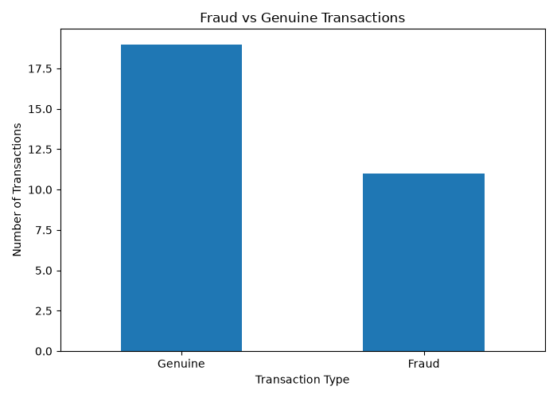

### Transaction Amount Distribution

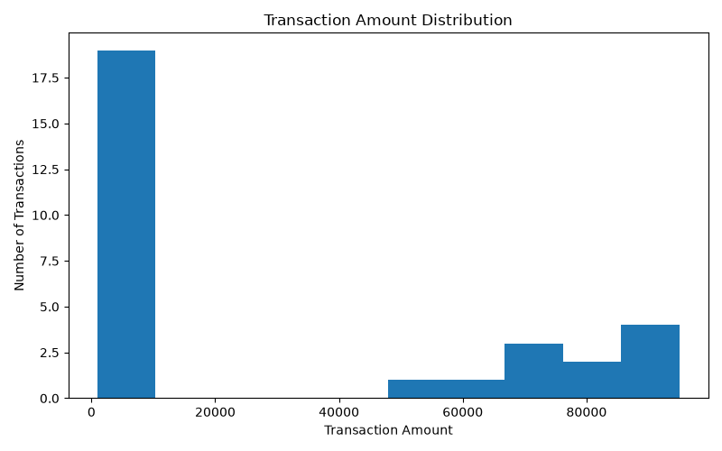

### Transaction Type Analysis

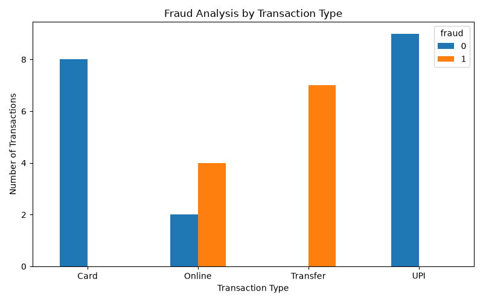

### Location Analysis

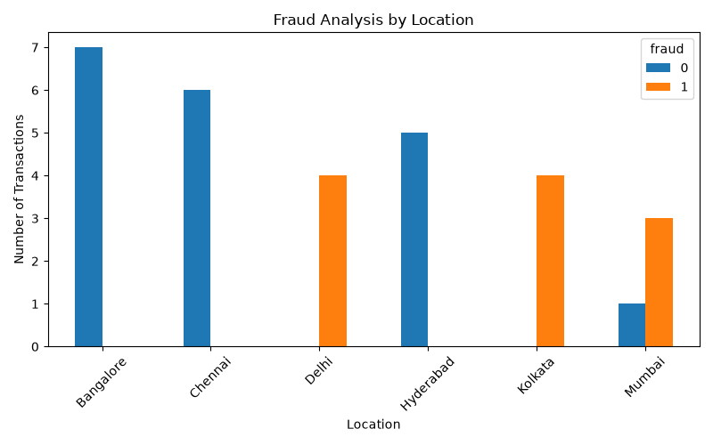

### Device Analysis

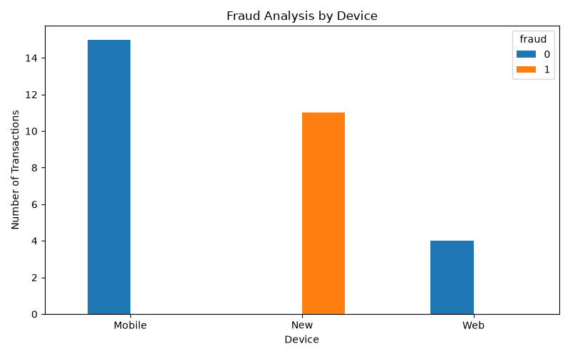

### Feature Correlation

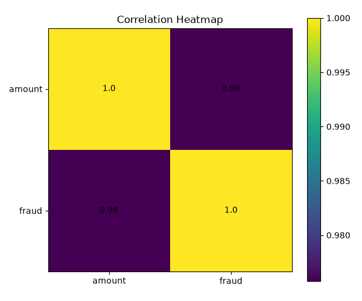

### Model Evaluation

#### Confusion Matrix

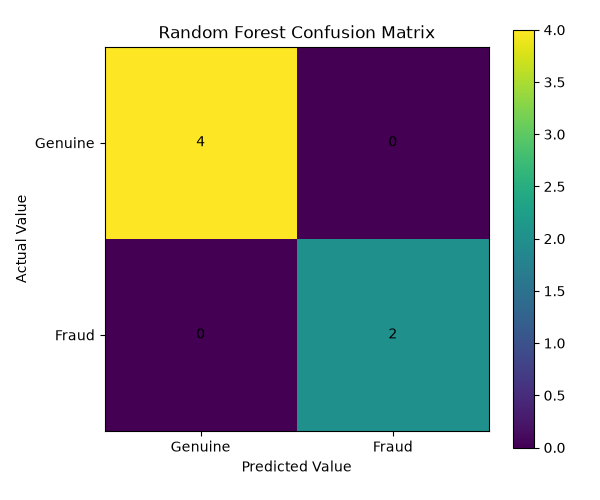

#### ROC Curve

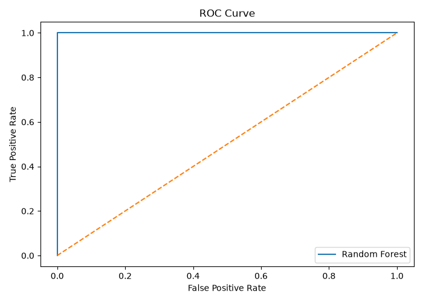

### Risk Analysis

#### Risk Distribution

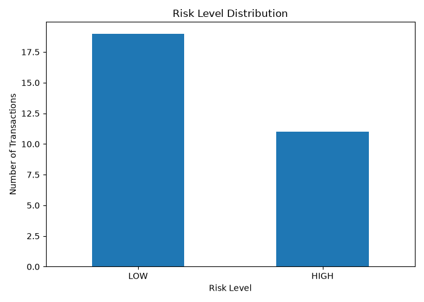

#### Risk Score Distribution

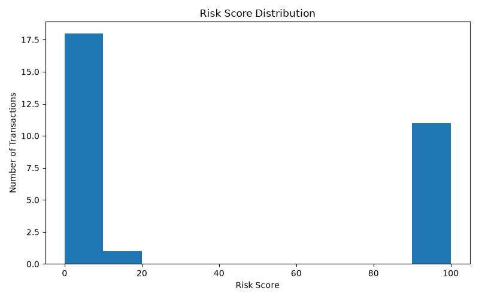

---

## Repository Structure

```text
Banking_fraud_detection/
│
├── banking_fraud.csv
├── fraud_detection.py
├── requirements.txt
├── .gitignore
├── README.md
│
└── outputs/
    ├── model_metrics.csv
    ├── new_transaction_result.csv
    ├── transaction_risk_scores.csv
    │
    └── plots/
        ├── fraud_distribution.png
        ├── transaction_amount_distribution.png
        ├── transaction_type_fraud.png
        ├── location_fraud.png
        ├── device_fraud.png
        ├── correlation_heatmap.png
        ├── confusion_matrix.png
        ├── roc_curve.png
        ├── risk_distribution.png
        └── risk_score_distribution.png
```

## Output Files

### `model_metrics.csv`

Stores the evaluation results for the implemented classification models.

### `new_transaction_result.csv`

Stores the prediction and risk information generated for the new transaction.

### `transaction_risk_scores.csv`

Stores transaction-level fraud probabilities and risk scores.

### `outputs/plots/`

Contains the visualizations generated during analysis and model evaluation.

## Technology Stack

| Area | Technology |
|------|------------|
| Language | Python |
| Data Processing | Pandas, NumPy |
| Machine Learning | Scikit-learn |
| Visualization | Matplotlib |
| Version Control | Git |
| Repository Hosting | GitHub |

## Project Setup

Clone the repository:

```bash
git clone https://github.com/harshaharshu09/Banking_fraud_detection.git
```

Move into the project directory:

```bash
cd Banking_fraud_detection
```

Install the required packages:

```bash
pip install -r requirements.txt
```

Run the project:

```bash
python fraud_detection.py
```

The generated metrics, predictions, risk scores, and charts are stored in the `outputs/` directory.

## Reproducibility

The implementation uses fixed random states for the train/test split and Random Forest model.

The execution flow is:

```text
Load Data
   |
   v
Inspect Data
   |
   v
Clean Data
   |
   v
Analyze Transactions
   |
   v
Prepare Features
   |
   v
Encode Categories
   |
   v
Split Data
   |
   v
Train Models
   |
   v
Evaluate Models
   |
   v
Generate Probability
   |
   v
Calculate Risk Score
   |
   v
Assign Risk Category
   |
   v
Save Results
```

## Limitations

- The current dataset is relatively small and is intended for project-level analysis.
- The current test results are not representative of production performance.
- Fraud behavior can change over time.
- The current risk thresholds are manually defined.
- The implementation does not connect to a live banking transaction system.
- No real-time transaction processing or model monitoring is included.

## Further Development

The current implementation can be extended in the following areas:

- Larger and more representative transaction datasets
- Customer-level transaction history
- Time-based behavioral features
- Real-time transaction scoring
- Hyperparameter tuning
- Cross-validation
- Probability calibration
- Risk threshold optimization
- Model explainability
- Model drift monitoring
- API deployment
- Database integration
- Real-time scoring services

## Responsible Use

A fraud prediction should be treated as a risk signal rather than definitive evidence of fraudulent activity.

A production implementation would require additional verification procedures, business rules, human review, monitoring, and applicable compliance controls.

## Repository

GitHub repository:

https://github.com/harshaharshu09/Banking_fraud_detection